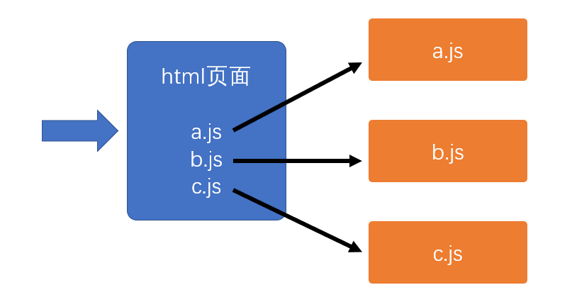
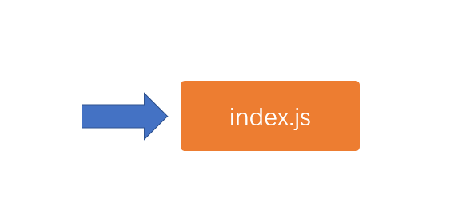

# 安装nodejs

官网地址：https://nodejs.org/zh-cn/

**浏览器**

浏览器运行的是html页面，并加载页面中通过script元素引入的js

**nodejs**

nodejs直接运行某个js文件，该文件被称之为入口文件

nodejs遵循EcmaScript标准，但由于脱离了浏览器环境，因此：

1. 你可以在nodejs中使用EcmaScript标准的任何语法或api，例如：循环、判断、数组、对象等
2. 你不能在nodejs中使用浏览器的 web api，例如：dom对象、window对象、document对象等

由于大部分开发者是从浏览器端开发转向nodejs开发的，为了降低开发者的学习成本，nodejs中提供了一些和浏览器web api同样的对象或函数，例如：console、setTimeout、setInterval等