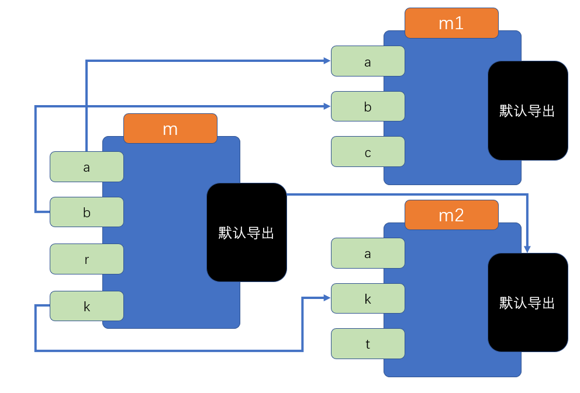

# ES6模块化的其他细节

1. **尽量导出不可变值**

当导出一个内容时，尽量保证该内容是不可变的（大部分情况都是如此）

因为，虽然导入后，无法更改导入内容，但是在导入的模块内部却有可能发生更改，这将导致一些无法预料的事情发生

2. **可以使用无绑定的导入用于执行一些初始化代码**

如果我们只是想执行模块中的一些代码，而不需要导入它的任何内容，可以使用无绑定的导入：

```js
import "模块路径"
```

3. **可以使用绑定再导出，来重新导出来自另一个模块的内容**

有的时候，我们可能需要用一个模块封装多个模块，然后有选择的将多个模块的内容分别导出，可以使用下面的语法轻松完成

```js
export {绑定的标识符} from "模块路径"
```

